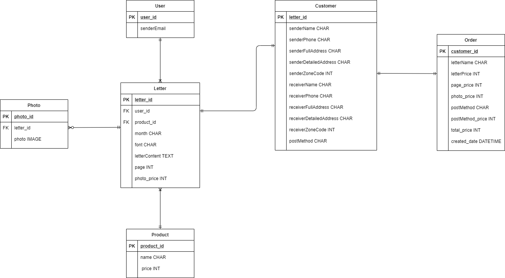

# :love_letter:느리게 가는 편지 SeeYouLetter 
팀원 구성 : 기획자 1명, 디자이너 2명, 프론트 개발자 1명, 백엔드 개발자 1명

'느리게 가는 편지 씨유레터' 는  IT 서비스에 익숙하면서도 아날로그 감성을 추구하는 Z세대를 위한 온라인으로 편지를 작성하여 오프라인으로 감성적인 제품을 받는 서비스입니다.     

## Branch Structure

* deploy branch : 최종 배포 코드 저장된 브랜치
* develop branch : 배포 전 기능 확인 브랜치
* feature branch : 추가할 기능을 위한 브랜치      

## Commit rule

|  Keyword  | Description                                  |
| :-------: | -------------------------------------------- |
|   [ADD]   | 코드 추가가 있을 때 사용                     |
|   [FIX]   | 올바르지 않은 로직을 고친 경우에 사용        |
| [REMOVE]  | 코드의 삭제가 있을 때 사용                   |
| [CORRECT] | 문법 오류나 타입의 변경, 이름 변경 등에 사용 |

## About SeeYouLetter

* **DB 설계도**

  

- **API docs**

  [SeeYouLetter](https://documenter.getpostman.com/view/12950398/TVzLofDg) 

## 개발 환경 

* Django REST framework  
* AWS rds - mysql
* AWS ec2 & Route53    

### More About SeeYouLetter

:love_letter:[Instagram](https://instagram.com/seeyouletter.official?igshid=1swsr0k141wdx)

